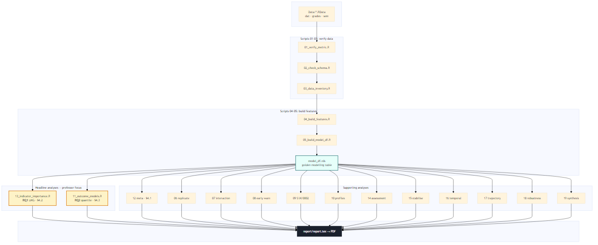

# Understanding the Moodle Engagement Research Pipeline

This document is for **your own understanding** of what each R script does, step by step, and how it connects to the report (`report/report.tex`). You built this by iterating (“vibe coding”); this is the map.

---

## The big picture in one paragraph

You take **raw Moodle log data** for five cohorts (STAT0002 and STAT0004, different years/delivery modes), verify that the engagement scores mean what you think, build **weekly Frequency / Immediacy / Diversity** features, join them to **final grades**, then run a chain of analyses. The report’s two **headline research questions** are:

1. **RQ1 — Which component matters most?** (LMG relative-importance in `13_indicator_importance.R` → Report §4.2)
2. **RQ2 — Does engagement affect all students equally?** (Quantile regression in `11_outcome_models.R` → Report §4.3)

Everything else supports validation, diagnostics, robustness, or practical limits.

---

## How data flows through the project

> **Note:** Cursor’s Markdown preview does **not** render ` ```mermaid ` blocks. Use the image below instead (open `understanding.md` preview with `Ctrl+Shift+V`).



| File | Purpose |
|------|---------|
| [docs/pipeline-flow.png](docs/pipeline-flow.png) | Rendered chart (use this in preview) |
| [docs/pipeline-flow.svg](docs/pipeline-flow.svg) | Detailed vector chart — open in browser to zoom |
| [docs/pipeline-flow.mmd](docs/pipeline-flow.mmd) | Mermaid source — edit and re-run `npx @mermaid-js/mermaid-cli -i docs/pipeline-flow.mmd -o docs/pipeline-flow.png` |

**Golden rule:** Almost every analysis script after `05` starts with:

```r
source("R/00_setup.R")
model_df <- readRDS("outputs/tables/model_df.rds")
```

If `model_df.rds` is missing, run `04` then `05` first (or `R/run_all.R`).

---

## The five cohorts

| `cohort_id` | Module | Year | Delivery | Notes |
|-------------|--------|------|----------|-------|
| `STAT0002_2021` | STAT0002 | 2020–21 | online | First-year foundations |
| `STAT0002_2223` | STAT0002 | 2022–23 | in_person | |
| `STAT0004_2021` | STAT0004 | 2020–21 | online | Second-year |
| `STAT0004_2122` | STAT0004 | 2021–22 | hybrid | Only hybrid cohort |
| `STAT0004_2223` | STAT0004 | 2022–23 | in_person | |

**Critical design fact:** Delivery condition is **confounded with academic year**. You cannot claim “online causes X”; you can only describe patterns across module-years.

---

## Engagement metrics (F, I, D, IDF)

From Johnston et al. (chapter-aligned metric):

| Indicator | Meaning in plain English |
|-----------|-------------------------|
| **Frequency** | How often the student interacts (session / log volume) |
| **Immediacy** | How soon after release they access new material |
| **Diversity** | Variety of resource types they touch within a chapter |
| **IDF** | Sum F + I + D (composite engagement score) |

In your pipeline:

- **Weekly** values = sum of chapter contributions that week (`freq_week`, `imm_week`, `div_week`, `IDF_week`)
- **Cumulative** values = running sum from week 1 to week *t* (`cum_freq`, `cum_imm`, `cum_div`, `cum_IDF`)
- **Z-scores** = standardised **within each cohort × week** so “+1 SD” is comparable across students in the same cohort at the same time

---

## Report map: which script feeds which section

| Report section | Main scripts | What it answers |
|----------------|--------------|-----------------|
| §3 Data | `03_data_inventory.R` | Who is in the sample, grade stats |
| §4.1 Overall association | `06`, `12` | Does engagement correlate with grade at all? |
| **§4.2 RQ1 — Components** | **`13`** | Which of F/I/D matters most under collinearity? |
| **§4.3 RQ2 — Quantiles** | **`11`** | Is the link stronger for weaker students? |
| §4.4 Supporting diagnostics | `15`, `17`, `14`, `16`, `10` | Trajectories, timing, assessment alignment |
| §4.5 Early-warning limits | `08` | Can you flag at-risk students accurately? |
| §4.6 Boundary / robustness | `07`, `09`, `18`, `12` | Delivery confounding, sensitivity checks |
| Discussion / Conclusion | `19_synthesis.R` | One-line verdicts per question |

---

## Shared infrastructure

### `R/00_setup.R` — start here every time

**What it does:**

1. Loads dplyr, ggplot2, tidyr, etc.
2. Defines paths: `Data/`, `outputs/figures/`, `outputs/tables/`
3. Defines `COHORTS` registry (the five module-years)
4. Provides `load_cohort()` — reads one `*_data.RData` file, tags rows with `cohort_id` and `condition`
5. Provides `load_all()` — stacks all cohorts’ `sem` or `grades` tables
6. Helpers: `num_na()`, `save_tab()`, `save_fig()`

**Report link:** Underpins everything; cohort table in §3 comes from inventory built on these loaders.

---

### `R/features.R` — feature engineering toolkit

Not run on its own; sourced by `04`, `05`, `06`, etc.

| Function | Step-by-step logic | Used for |
|----------|-------------------|----------|
| `tidy_sem()` | Wide `sem` table → long format: one row per user × week × dimension × chapter | All feature building |
| `weekly_engagement()` | Sum F/I/D across chapters per week; fill missing weeks with 0 | Weekly + cumulative metrics |
| `add_cumulative()` | `cumsum()` of weekly F/I/D/IDF per student | “Engagement up to week *t*” |
| `standardise_within()` | Z-score columns within `cohort_id × week` | Regression coefficients in SD units |
| `attach_grades()` | Inner join grades; **drop `final_grade ≤ 0`** (exam absences) | Analysis sample |
| `phase_features()` | Mean engagement in early/mid/late term thirds | Phase summaries |
| `student_profile()` | Per-student: mean level, SD, trend slope, F:I:D balance | Script `10` clustering |
| `spearman_ci()` | Spearman ρ + approximate 95% CI | Weekly correlation plots |

**Report link:** §3 “Engagement feature construction”; cumulative IDF definition.

---

### `R/run_all.R` — run everything

Runs scripts `01` through `19` in order. Use when you want a full refresh of all tables and figures.

---

## Phase 1: Data trust (scripts 01–03)

### `R/01_verify_metric.R`

**Research purpose:** Before trusting `sem`, confirm whether `*_contrib` values are **per-week increments** or **cumulative totals**.

**Steps:**

1. Load STAT0004 hybrid cohort (`dat` = event log, `sem` = precomputed contributions).
2. From `dat`, **reconstruct** raw Frequency (distinct sessions per chapter) and Diversity (distinct resource types) under two interpretations:
   - cumulative (count everything up to week *t*)
   - per-week (count only week *t*)
3. Compare Spearman(raw, `sem` contribution) **within each chapter × week** group.
4. Whichever interpretation gives ρ ≈ 1 is the correct semantics.

**Verdict in your data:** Per-week increments (not cumulative in `sem`).

**Report link:** Justifies §3 feature construction (“contributions are per-week increments; we cumsum ourselves”).

**Outputs:** `01_metric_semantics_check.csv`, `01_metric_semantics_verdict.txt`

---

### `R/02_check_schema.R`

**Research purpose:** Ensure all five cohorts have the **same column names** so you can row-bind and loop safely.

**Steps:**

1. `load_cohort()` for each of the five cohorts.
2. Compare column sets of `sem`, `grades`, `dat` to a reference cohort.
3. Report extra/missing columns and chapter column counts.

**Report link:** Implicit data-quality assurance (not a full section, but supports “five comparable cohorts”).

**Outputs:** `02_schema_consistency.csv`

---

### `R/03_data_inventory.R`

**Research purpose:** Document **who is in the analysis** and decide exclusion rules.

**Steps:**

1. For each cohort, count students in `sem` vs `grades`, overlap, weeks covered, chapters used.
2. Summarise grade distribution: mean, SD, % below 50, % below 40.
3. Count `final_grade == 0` (absences).
4. Write join rule: inner join on `User`; analyse only `final_grade > 0`.

**Report link:** Table 1 (cohort inventory), §3 sample size N = 1,291.

**Outputs:** `03_data_inventory.csv`, `03_join_rule.txt`

---

## Phase 2: Build the modelling dataset (scripts 04–05)

### `R/04_build_features.R`

**Research purpose:** Turn raw `sem` into analysis-ready weekly engagement tables.

**Steps:**

1. For each cohort: `sem` → `tidy_sem()` → `weekly_engagement()` → `add_cumulative()`.
2. Row-bind all cohorts into `weekly_all`.
3. Z-score weekly indicators within cohort × week (initial pass).
4. Also build `phase_features` (early/mid/late) and `student_profiles` (trajectory descriptors).
5. Save RDS files for downstream scripts.

**Report link:** §3 engagement feature construction.

**Outputs:** `weekly_engagement.rds`, `phase_features.rds`, `student_profiles.rds`

---

### `R/05_build_model_df.R`

**Research purpose:** Create **`model_df.rds`** — the single table almost all models use.

**Steps:**

1. Load `weekly_engagement.rds`.
2. Load and join `final_grade` from all cohorts.
3. **Exclude** students with `final_grade ≤ 0`.
4. Re-standardise weekly **and cumulative** F/I/D/IDF within cohort × week (on the analysis sample only).
5. Add binary flags: `low` (grade < 50), `fail` (grade < 40).

**Key columns for modelling:**

| Column | Meaning |
|--------|---------|
| `z_cum_freq`, `z_cum_imm`, `z_cum_div`, `z_cum_IDF` | Cumulative engagement, z-scored |
| `final_grade` | Outcome (0–100) |
| `week` | 1–11 |
| `cohort_id`, `condition`, `module` | Grouping / facets |

**Report link:** Foundation for all of §4.

**Outputs:** `model_df.rds`

---

## Phase 3: Paper replication & exploration (scripts 06–10)

### `R/06_replicate_paper.R`

**Research purpose:** Reproduce Johnston et al.’s core validity plots — “does engagement relate to grades over time?”

**Steps:**

1. **(A) Weekly Spearman correlations:** For each cohort × week × indicator (F, I, D, IDF), correlate **cumulative** engagement with `final_grade`. Plot ρ over weeks 1–11.
2. **(B) Quintile boxplots:** At weeks 3 and 6, split students into quintiles by `cum_IDF`; plot final grade distributions. Dashed line at 50%.

**Report link:** §4.1 (overall association), quintile figure; visual intuition for RQ2.

**Outputs:** `06_weekly_grade_corr.csv`, `06_quintile_boxplots_w3_w6.png`, `06_quintile_grade_summary.csv`

---

### `R/07_interaction.R`

**Research purpose:** On **STAT0004 only** (the module with all three delivery labels), ask: do engagement slopes **differ by condition**?

**Steps:**

1. Filter `model_df` to STAT0004.
2. Fit `final_grade ~ (z_cum_freq + z_cum_imm + z_cum_div) * condition` at each week.
3. Week 5 in detail: coefficients, `emmeans` slopes per condition, pairwise contrasts.
4. Plot slope trajectories weeks 1–11 per indicator.
5. ANOVA each week: does the interaction model beat main effects?

**Interpretation caution:** Condition = year = cohort → **not causal**.

**Report link:** §4.6 boundary condition (delivery confounding).

**Outputs:** `07_week5_*.csv`, `07_slopes_by_week.csv`, `07_slope_trajectories_STAT0004.png`

---

### `R/08_early_warning.R`

**Research purpose:** If you flag the **bottom 20%** of engagement each week, how good is that flag at finding low performers?

**Steps:**

1. Each cohort × week: `flag = cum_IDF <= 20th percentile`.
2. Compute:
   - **Recall** = among students with grade < 50, what fraction were flagged?
   - **Precision** = among flagged students, what fraction actually scored < 50?
   - **AUC** = discrimination of `cum_IDF` for `low`
3. Plot recall/precision over weeks; plot AUC.

**Report link:** §4.5 practical limits — modest precision (~15–26% at week 6).

**Outputs:** `08_early_warning_metrics.csv`, `08_recall_precision.png`, `08_auc_by_week.png`

---

### `R/09_stat0002_replication.R`

**Research purpose:** STAT0002 only has online + in-person. Does the online vs in-person pattern **match STAT0004**?

**Steps:**

1. Weekly correlations for STAT0002 by condition.
2. Interaction tests (engagement × condition) for STAT0002.
3. Cross-module comparison at week 11 and weekly curves for online vs in-person.

**Report link:** §4.6 boundary figure (`09_cross_module_weekly.png`).

**Outputs:** `09_stat0002_weekly_corr.csv`, `09_cross_module_weekly.png`, etc.

---

### `R/10_profiles_clustering.R`

**Research purpose:** Cluster students by **behaviour shape** (not raw scale): level, consistency, trend, F:I:D balance.

**Steps:**

1. Load `student_profiles.rds`, join grades, exclude absences.
2. Z-score profile features within cohort.
3. PAM clustering on distance matrix; choose *k* by silhouette width.
4. Profile clusters by mean grade and condition mix.

**Report link:** Less prominent than trajectories (`17`); exploratory complement to §4.4.

**Outputs:** `10_cluster_*.csv`, cluster figures

---

## Phase 4: Headline research questions (scripts 11–13)

### `R/11_outcome_models.R` — **RQ2: Does engagement affect all students equally?**

**Report section:** §4.3

**Why this script exists:** Average correlation or OLS hides whether engagement matters **more for weak students**. Quantile regression estimates separate slopes at different parts of the grade distribution.

#### Part A — Model specification check

**Steps:**

1. For each cohort × week (6 and 11), fit three models predicting grade from F+I+D:
   - OLS on raw 0–100 grades
   - Fractional logit on grade/100
   - Beta regression (handles bounded outcomes)
2. Check whether conclusions (sign of coefficients) agree.

**Report link:** §4.6 robustness — conclusions robust to specification.

#### Part B — Quantile regression (main RQ2 analysis)

**Steps:**

1. Define quantiles τ = 0.1, 0.25, 0.5, 0.75, 0.9.
2. For each cohort × week × τ, fit:
   ```r
   rq(final_grade ~ z_cum_IDF, tau = τ)
   ```
   Slope = grade points gained per +1 SD engagement **among students at that quantile of the grade distribution**.
3. Repeat with all three predictors jointly (`z_cum_freq + z_cum_imm + z_cum_div`).
4. **Univariate** models: one indicator at a time → which component drives lower-tail effects?
5. **Tail contrast:** Compare τ=0.1 slope minus τ=0.5 slope (descriptive).
6. **Bootstrap CI:** Resample students within cohort, refit τ=0.1 and τ=0.5, store difference → formal uncertainty on “steeper at bottom”.
7. Figures: slope vs τ by cohort (weeks 6 and 11); univariate mean slopes.

**How to read results:**

| Pattern | Meaning |
|---------|---------|
| Slope largest at τ=0.1, smaller at τ=0.5, smaller still at τ=0.9 | Engagement matters **most for lower-performing students** |
| Similar slopes at all τ | Engagement is a **universal** predictor |
| Your data | τ=0.1 > τ=0.5 in **every** cohort; mean excess ≈ +2.3 grade points per SD |

**Univariate finding:** Immediacy has the largest mean τ=0.1 slope (~4.9 pts/SD) when indicators are alone; complements LMG (which is multivariate).

**Outputs:** `11_quantile_idf.csv`, `11_quantile_univariate.csv`, `11_tail_contrast_bootstrap.csv`, `11_quantile_idf.png`, `11_quantile_idf_wk6.png`, `11_quantile_univariate.png`

---

### `R/12_pooled_mixed_meta.R` — **Does the metric “travel” across cohorts?**

**Report section:** §4.1

**Steps:**

1. **Mixed-effects model** (week 11): `final_grade ~ z_cum_IDF + (z_cum_IDF | cohort_id)` → pooled slope ≈ 3.8 grade points per SD, random slope SD across cohorts.
2. **Random-effects meta-analysis:** Convert each cohort’s Pearson *r* to Fisher *z*, pool with `metafor::rma`, report pooled *r*, CI, I².
3. Test whether **condition** moderates pooled effect (under-powered, descriptive).
4. Forest plot for IDF.

**Headline:** Pooled *r* ≈ 0.32, I² ≈ 39% → moderate association, travels across cohorts.

**Outputs:** `12_meta_pooled.csv`, `12_forest_IDF.png`, `12_mixed_models.csv`

---

### `R/13_indicator_importance.R` — **RQ1: Which component matters most?**

**Report section:** §4.2

**The problem:** F, I, and D are **highly correlated** (|r| ≈ 0.75–0.83). If you throw them all in OLS, partial coefficients are unstable and misleading.

**The solution:** **LMG relative importance** — fairly splits R² among predictors by averaging over all entry orderings.

#### Step-by-step

1. **Collinearity diagnostics** (weeks 6 and 11, each cohort):
   - Mean absolute pairwise correlation among `z_cum_freq`, `z_cum_imm`, `z_cum_div`
   - VIF from `car::vif()` — values > 2–3 mean overlap is a problem

2. **LMG decomposition** (weeks 6 and 11, each cohort):
   ```r
   m <- lm(final_grade ~ z_cum_freq + z_cum_imm + z_cum_div, data = sub)
   calc.relimp(m, type = "lmg")
   ```
   - `lmg_r2` = absolute variance each indicator explains
   - `lmg_share` = percentage of explained variance (sums to 100% per cohort)

3. **Pooled means** across cohorts with bootstrap (resample cohorts with replacement).

4. **PCA sanity check:** Does a single combined PC of F+I+D correlate with grade?

5. **Figures:** Stacked bars by cohort (week 6 vs 11 faceted); pooled share bar chart.

**How to read results:**

| Finding | Interpretation |
|---------|----------------|
| Bivariate *r* similar for F, I, D (~0.28–0.31) | Looks like all matter equally |
| LMG shares: Diversity ~37%, Immediacy ~36%, Frequency ~27% | Once overlap removed, **frequency (raw clicks) matters least** |
| Diversity top in STAT0004; Immediacy top in STAT0002 online | Module-specific emphasis, but Frequency never wins |

**Outputs:** `13_lmg_importance.csv`, `13_collinearity.csv`, `13_lmg_pooled_bootstrap.csv`, `13_lmg_importance.png`

---

## Phase 5: Supporting diagnostics (scripts 14–18)

### `R/14_assessment_validity.R`

**Question:** Does engagement track **exam/individual** work more than **group/peer** marks?

**Steps:**

1. Pull component marks from each cohort’s `grades` table.
2. Correlate `cum_IDF` (week 11) with each component.
3. **Steiger’s test** (via `cocor`): is *r*(engagement, exam) > *r*(engagement, peer-marking) on the same students?

**Report link:** §4.4 — exam *r* = 0.40 vs peer *r* = 0.20 in STAT0002 in-person (*p* = 0.003).

**Outputs:** `14_component_correlations.csv`, `14_dependent_corr_tests.csv`, figure

---

### `R/15_timing_stabilisation.R`

**Question:** How **early** does the engagement–grade correlation stabilise?

**Steps:**

1. For each cohort, bootstrap students repeatedly.
2. At each week *w*, compute Spearman ρ(cum_IDF, grade) and compare to week-11 ρ.
3. **Stabilisation week** = first week where 95% CI of (ρ₁₁ − ρ_w) includes 0.

**Report link:** §4.4 — ranges week 1–9; early stabilisation ≠ strong early signal.

**Outputs:** `15_stabilisation_week.csv`, `15_stabilisation.png`

---

### `R/16_eventlog_temporal.R`

**Question:** Does **how** students study (regularity, gaps, cramming) add information **beyond** F+I+D?

**Steps:**

1. From raw `dat` event log up to week 6, compute per student:
   - week entropy, gap SD between active days, late-night fraction, breadth of Moodle components, cramming fraction
2. Merge with `model_df` week 6.
3. Nested F-test: does `final_grade ~ F+I+D + temporal` beat `final_grade ~ F+I+D`?

**Report link:** §4.4 Table temporal — significant incremental R² in STAT0002 only.

**Outputs:** `16_incremental_value.csv`, `16_temporal_feature_corr.png`

---

### `R/17_trajectory_models.R`

**Question:** Do **engagement trajectories over time** separate outcomes better than a snapshot?

**Steps:**

1. Take weekly `z_IDF_week` per student (weeks 1–11).
2. Fit **latent-class mixed models** (`lcmm::hlme`) with quadratic time, 1–3 classes; pick by BIC.
3. Assign each student to a trajectory class (low-steady, high-steady, mid-variable).
4. Compare grades across classes (Kruskal–Wallis).
5. **Early assignment:** Can you guess end-of-term class from weeks 1–*w* only?

**Report link:** §4.4 — ~9.7 grade point gap; 81% recall for low-steady by week 4.

**Outputs:** `17_trajectory_classes.csv`, trajectory figures

---

### `R/18_covariate_robustness.R`

**Question:** Are headline findings **fragile** to confounders or arbitrary choices?

**Four checks:**

1. **Programme adjustment:** Add degree programme dummies — does Diversity slope change? (≤14% attenuation)
2. **EC sensitivity:** Drop students with extenuating circumstances minutes > 0
3. **Benjamini–Hochberg:** Correct 220 weekly correlation tests — 205 still significant
4. **Threshold robustness:** Early-warning at 10/20/30% flags, cumulative vs weekly

**Report link:** §4.6 robustness subsection.

**Outputs:** `18_programme_adjustment.csv`, `18_weekly_family_BH.csv`, etc.

---

## Phase 6: Synthesis (script 19)

### `R/19_synthesis.R`

**What it does:** Reads key output CSVs from scripts 11–18 and builds **one master table** mapping each question → statistic → plain-language verdict.

**Why it exists:** Quick reference when writing; mirrors the report’s logic.

**Report link:** Not printed directly, but aligns with Discussion bullets.

**Outputs:** `19_results_synthesis.csv`

---

## Quick reference: your two professor focus points

### RQ1 — Which aspects of engagement matter most?

| Step | Script | What happens |
|------|--------|--------------|
| 1 | `05` | Build z-scored cumulative F, I, D per student-week |
| 2 | `13` | Show F/I/D are collinear (VIF, correlations) |
| 3 | `13` | LMG split of R² at weeks 6 and 11 |
| 4 | `12` | Contrast: bivariate *r* looks equal across F/I/D |
| 5 | Report §4.2 | Interpret: breadth + promptness > raw frequency |

**One-sentence answer:** Diversity and Immediacy explain more unique grade variance than Frequency; bivariate correlations alone would hide this.

---

### RQ2 — Does engagement affect all students equally?

| Step | Script | What happens |
|------|--------|--------------|
| 1 | `05` | Same modelling dataset |
| 2 | `11` | Quantile regression at τ = 0.1 … 0.9 |
| 3 | `11` | Compare τ=0.1 vs τ=0.5 slopes (+ bootstrap CI) |
| 4 | `11` | Univariate quantile: Immediacy strongest at lower tail |
| 5 | `06` | Quintile boxplots as visual backup |
| 6 | Report §4.3 | Interpret: support tool for at-risk learners, not uniform predictor |

**One-sentence answer:** Slopes are steepest among lower-performing students; engagement variation matters most where grades are already low.

---

## How to re-run things

From project root (PowerShell):

```powershell
cd "c:\Users\Syeds\Desktop\Moodle Log Data Research"
& "C:\Program Files\R\R-4.4.3\bin\Rscript.exe" R/run_all.R
```

Or just the headline scripts after `05`:

```powershell
& "C:\Program Files\R\R-4.4.3\bin\Rscript.exe" R/13_indicator_importance.R
& "C:\Program Files\R\R-4.4.3\bin\Rscript.exe" R/11_outcome_models.R
& "C:\Program Files\R\R-4.4.3\bin\Rscript.exe" R/19_synthesis.R
```

Recompile report:

```powershell
cd report
pdflatex report.tex
pdflatex report.tex
```

---

## Glossary

| Term | Meaning |
|------|---------|
| **LMG** | Lindeman–Merenda–Gold relative importance; fair R² shares under collinearity |
| **Quantile regression** | Regression at conditional quantiles of *Y* (e.g. 10th percentile of grades) |
| **τ (tau)** | Quantile level; τ=0.1 = bottom 10% of grade distribution |
| **VIF** | Variance inflation factor; high VIF = predictor overlaps others |
| **I²** | Meta-analysis heterogeneity; % of variance due to cohort differences |
| **PAM** | Partitioning Around Medoids clustering |
| **lcmm / hlme** | Latent-class mixed model for trajectories |
| **BH** | Benjamini–Hochberg false discovery rate correction |

---

## Files you can ignore unless debugging

| File | Role |
|------|------|
| `required_packages.R` | Package list |
| `report/report.aux`, `.log`, `.out` | LaTeX build artefacts |
| `outputs/tables/*.rds` | Intermediate binary data |

---

*Last aligned with pipeline after RQ1/RQ2 deepening (weeks 6+11 LMG and quantile extensions).*
